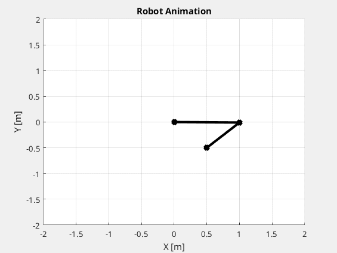

# OSS_AIR2st
**Potrzebujemy cholernie dużo wykresów, jakichś statystyk etc**

## 0. Wstęp

Opisujemy:

1. Cel ćwiczenia
2. Założenia labków - 3 regulatory
3. Model nieliniowy robota SCARA
4. Zasięg robota SCARA
5. Utilities: kinematyka prosta i odwrotna

Wykresy:

- przestrzeń robocza (pierścień)
- tanh(x) i sgn(x)
- konfiguracje SCARA (*above* i *below*)

## 1. Część 1 - regulator czasooptymalny

Opisujemy:

1. Idea regulatora czasooptymalnego
2. Optymalizacja - funkcja kosztu/celu/straty
    
    $$J(x,T) = T + (x-x_{f})*W*(x-x_f) $$

3. Hamiltonian, równania sprzężone
4. Idea sterowania bang-bang i jej konsekwencje - funkcja przełączająca
5. Metodyka optymalizacji - solver, rozwiązywanie przedziałami, gradient
6. Algorytm porządkowania czasów przełączeń - dla 2 sterowań
7. Algorytm pomocniczy - simple gradient
8. Wyniki dla przykładowych punktów i trajektorii w przestrzeni roboczej
9. Obszary osiągalne (stabilnie) przy 2-ch, 3-ch i 4-ch przełączeniach

    Kryterium osiągnięcia stanu końcowego etc.

Wykresy:
   
- obszary osiągalne z pktu (1,0) (najlepiej imo zrobić jako mesh o rastrze 0.01m)
- Kilka - kilkanaście punktów z przestrzeni (dowolnie, ale nie trywialnie :D) - Do każdego wrzucić

    - Wykres f-cji przełączającej na tle sterowania fi(t), u(t)
    - Wykres stanu i sterowania x(t), u(t)
    - Wykres zmiennych sprzężonych psi(t)
    - Wykres trajektorii (x,y)(t)
    - Animacji to nie :P

Plusik jest taki, że te rzeczy generują się same - kwestię zmiany ścieżki i nazwy zapisywanego pliku pozostawiam

## 2. Część 2 - regulator z optymalizacją kwadratową

1. Idea regulatora 2
2. Funkcja kosztu

$$J(x,u) = \int_0^T [u(t)Ru(t) + (x(t)-x_{ref}(t))W(x(t)-x_{ref}(t))] dt + (x(T) - x_f)W_{stat}(x(T) - x_f)$$

3. Hamiltonian i nowe części równań sprzężonych i stanu - obliczanie całek
4. Nowy gradient
5. Wyniki, testy - różne trajektorie
6. Analiza jakościowa - poszczególne komponenty funkcji kosztu - gdzie, co i jak : warianty

    - różne wagi - zakładamy R = const i zmieniamy W i Wstat w skali logarytmicznej
    - różne czasy trwania symulacji - co się dzieje jak T jest małe, odpowiednie i duże
    - jak zmiana samplingu zmienia rozwiązanie problemu - co przy samplingu 5 Hz, 10 Hz, 20 Hz, 50 Hz i 100 Hz (może więcej, ale szkoda kompa na 1kHz+)

7. Wyniki dla różnych trajektorii - obieramy kilka ciekawych - przykładowo:

    - fragment okręgu
    - fragment elipsy
    - linia prosta, po osi x, y i na skos
    - trajektoria z wierzchołkiem "V"
    - trajektoria z prędkością niejednostajną (powiedzmy e^t lub sint lub t^2)

- **Uwaga na warunki brzegowe!** Można symulację rozpocząć zarówno przy v=0 (zadanie odtworzenia trajektorii), lub przy v=v0 (zadanie utrzymania trajektorii)

Wykresy:
   
Każda trajektoria będzie potrzebowała takich rzeczy:

- Jak w reg topt 
    - Wykres f-cji przełączającej na tle sterowania fi(t), u(t)
    - Wykres stanu i sterowania x(t), u(t)
    - Wykres zmiennych sprzężonych psi(t)
    - Wykres trajektorii (x,y)(t)
    - Animacji to nie :P
- Dodatkowo:
    - wykresy błędu 

    $$ e(t) = x(t) - x_{ref}(t) $$

Miło by było jakby powstały wizualizacje, co dzieje się z funkcją kosztu jak się zmieniają wagi itd.

## 3. Część 3 - Model Predictive Control

1. Idea regulacji predykcyjnej o skończonym horyzoncie
2. Warianty regulacji predykcyjnej
3. Implementacja MPC
4. Wyniki, testy - jak wyżej, tylko można ciekawsze trajektorie:

    - pełny okrąg **done**
    - kwadrat **done**
    - "s" kształt **done**
    - trajektoria z wierzchołkiem **done**
    - sinusoida 
    - *wobbly* okrąg

5. Analiza jakościowa i porównanie z poprzednim regulatorem
6. Analiza pod kątem długości kroku i horyzontu predykcji

Wykresy:

- Jak wyżej :D

## 4. Wnioski, przemyślenia (opcjonalne, Bania nie Iwonka)

Szkoda że gify się w pdfach nie animują XD, ładnie śmiga

*TODO - trackline na gifie?*

